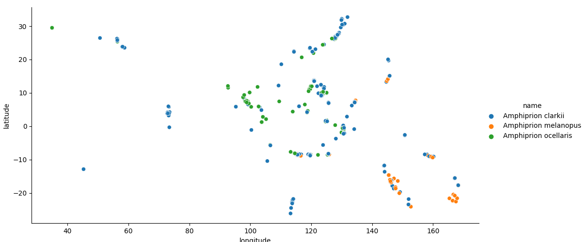

# Map of *Amphiprion* occurrences

## How to create the figure

This figure is produced through the following steps:

  1. using [`GBIF.jl`](https://github.com/EcoJulia/GBIF.jl/) to get the [GBIF](https://www.gbif.org/) data on the occurrence of the genus *Amphiprion*
  2. using [`matplotlib`](https://matplotlib.org/) to visualize them -- the map is color-coded by species name
  3. publishing the result through github pages
  
All of these steps are independant, and only "communicate" using *artifacts*. The entire pipeline runs once a week (monday at midnight), on every push to the `master` branch, and on every pull request - this ensure that the results remain up to date both with regard to changes to the data, and to changes to the code.
 
 
## See the underlying data
  
You can find a link to the data here: [`occurrences.csv`](occurrences.csv)
